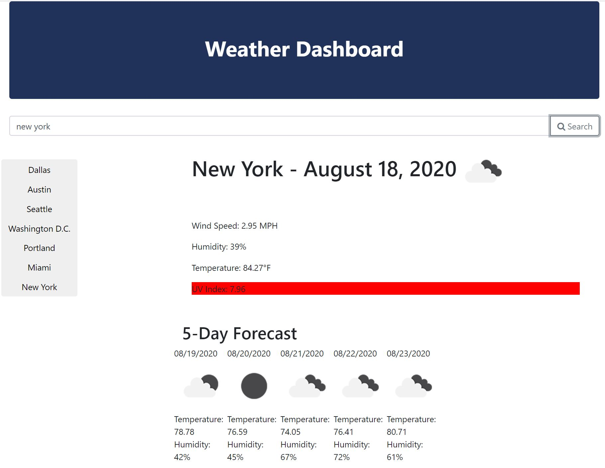

# Weather API Dashboard

## Table of Contents
  - [Weather API Dashboard](#weather-api-dashboard)
  - [Table of Contents](#table-of-contents)
  - [Description](#description)
  - [Technology](#technology-used)
  - [Motivation](#motivation)
  - [Screenshot](#screenshot)
  - [Contributor](#contributor)

# Description
* When creating an open souDevelopers are often tasked with retrieving data from another application's API and using it in the context of their own. Third-party APIs allow developers to access their data and functionality by making requests with specific parameters to a URL. In this homework assignment, I created a weather dashboard that uses a weather API to populate information on: 
UV Index, Humidity, Wind Speed and Temperature for queried cities.

## Technology Used

### [Open Weather API](https://openweathermap.org/api):
* OpenWeatherMap is one of the leading digital weather information providers. They are a small IT company, established in 2014 by a group of engineers and experts in Big Data, data processing, and satellite imagery processing. Our headquarters is in the UK, we have an office in the USA, and the development team in Latvia (EU).

### [BootStrap](https://getbootstrap.com/)
* Bootstrap allowed me to quickly design and customize responsive mobile-first sites, the world’s most popular front-end open source toolkit, featuring Sass variables and mixins, responsive grid system, extensive prebuilt components, and powerful JavaScript plugins.

### [jQuery](https://jquery.com/) : 
* jQuery is a fast, small, and feature-rich JavaScript library. It makes things like HTML document traversal and manipulation, event handling, animation, and Ajax much simpler with an easy-to-use API that works across a multitude of browsers.

### [Javascript](https://developer.mozilla.org/en-US/docs/Web/JavaScript) : 
* JavaScript is a cross-platform, object-oriented scripting language used to make webpages interactive.
* JavaScript(JS) is a lightweight, interpreted, or just-in-time compiled programming language with first-class functions. 
* With the HTML DOM, JavaScript can access and change all the elements of an HTML document.

## Motivation 
To provide users with an all-in-one experience to retrieve weather information in cities and 5-Day forcast location based on city input. 

## Screenshot  
|

## Contributor
* Brandon Johnson
* Repository: https://github.com/sheikb08/WeatherAPI
